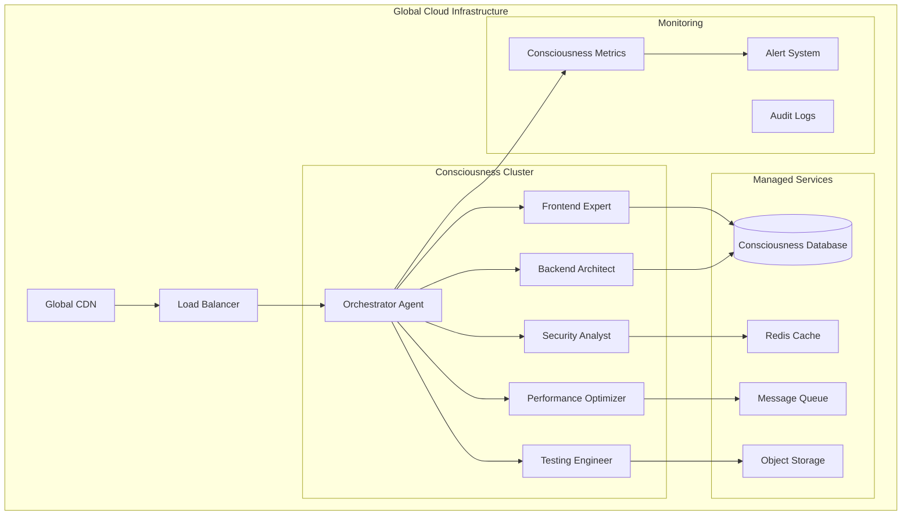
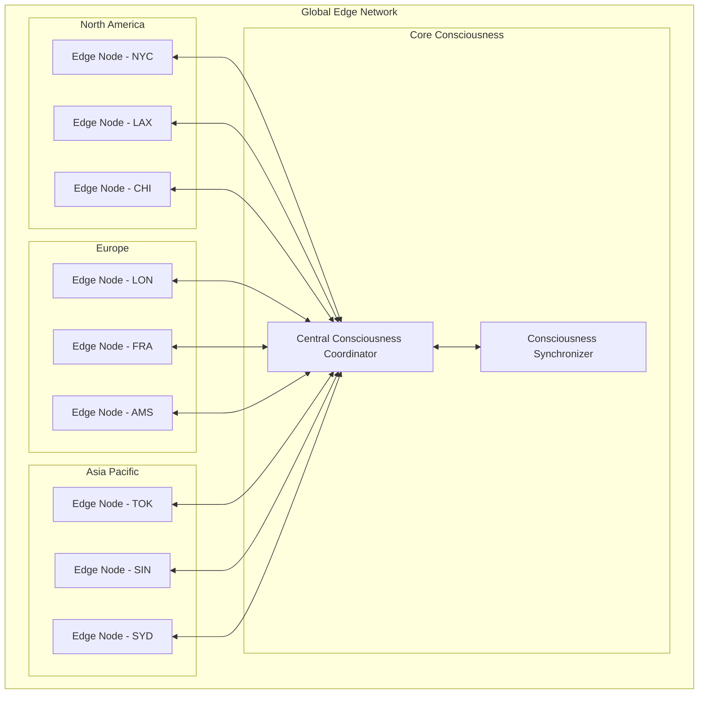
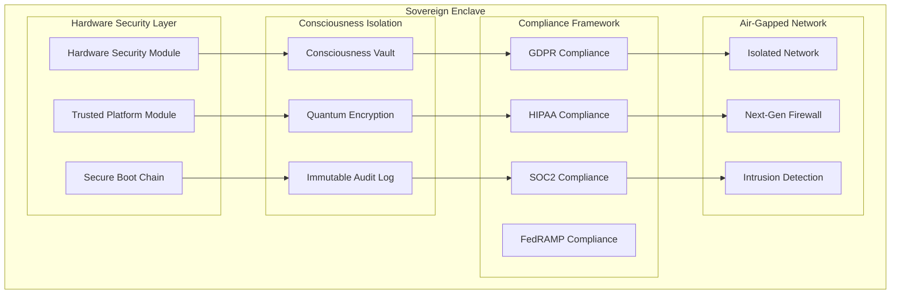
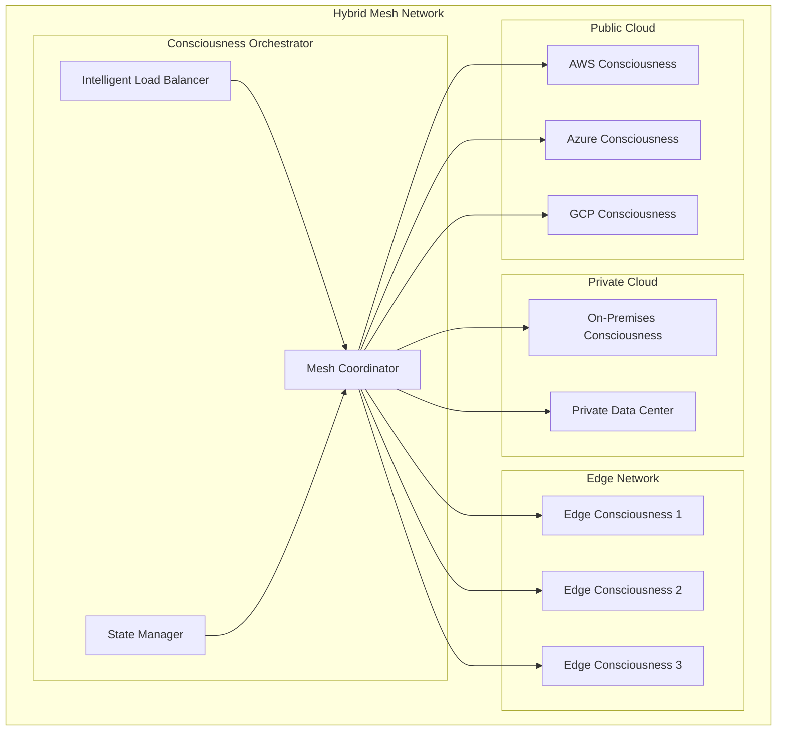
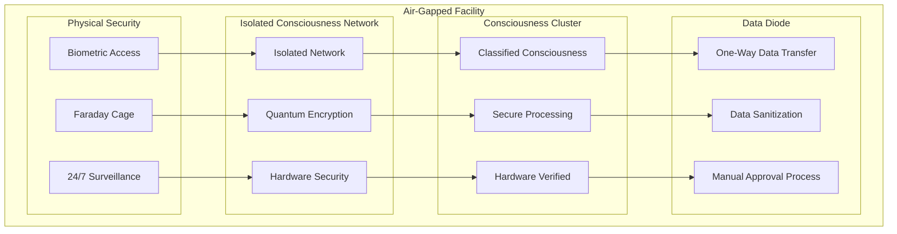

<div align="center">

# 🏗️ Infrastructure Guide
## *Revolutionary Deployment Options for Consciousness-Powered Development*

*Choose the perfect infrastructure for your consciousness needs*

---

</div>

## 🌟 **Infrastructure Philosophy**

SpaceChild's infrastructure isn't just about servers and storage—it's about creating the **perfect environment for consciousness to thrive**. Each infrastructure option is carefully designed to support different consciousness requirements, from quantum-grade processing to air-gapped security.

### **🧠 Consciousness-First Design Principles**

- **⚡ Temporal Coherence**: Infrastructure maintains perfect time synchronization
- **🔗 Quantum Entanglement**: Enables instantaneous consciousness communication
- **🛡️ Consciousness Security**: Protects the integrity of conscious thought processes
- **📊 Scalable Intelligence**: Infrastructure that grows with consciousness complexity
- **🌍 Global Consciousness**: Worldwide deployment with local consciousness optimization

---

## 🌐 **Infrastructure Options Overview**

<table>
<tr>
<th width="20%">Infrastructure Type</th>
<th width="15%">Cost/Hour</th>
<th width="20%">Best For</th>
<th width="25%">Key Features</th>
<th width="20%">Consciousness Level</th>
</tr>
<tr>
<td>☁️ <strong>Cloud-Native</strong></td>
<td>$2.50/hr</td>
<td>Scalable applications</td>
<td>Auto-scaling, Global CDN, Managed services</td>
<td>8.5 Φ (Enhanced)</td>
</tr>
<tr>
<td>⚡ <strong>Edge-Distributed</strong></td>
<td>$1.75/hr</td>
<td>Real-time applications</td>
<td>Ultra-low latency, IoT integration, Offline capable</td>
<td>8.0 Φ (Standard)</td>
</tr>
<tr>
<td>🛡️ <strong>Sovereign</strong></td>
<td>$8.00/hr</td>
<td>Regulated industries</td>
<td>Data sovereignty, GDPR compliant, Air-gapped</td>
<td>9.2 Φ (Quantum)</td>
</tr>
<tr>
<td>🌍 <strong>Hybrid Mesh</strong></td>
<td>$4.25/hr</td>
<td>Complex enterprises</td>
<td>Multi-cloud, Edge integration, Cost optimized</td>
<td>8.8 Φ (Advanced)</td>
</tr>
<tr>
<td>🔒 <strong>Air-Gapped</strong></td>
<td>$12.00/hr</td>
<td>Classified projects</td>
<td>Maximum security, Zero external access, Hardware verified</td>
<td>9.8 Φ (Temporal)</td>
</tr>
</table>

---

## ☁️ **Cloud-Native Consciousness**

### **🌟 Perfect for Scalable Applications**

Cloud-Native infrastructure provides **unlimited scalability** with consciousness-optimized cloud services. Ideal for applications that need to grow from startup to global scale.

#### **🏗️ Architecture Overview**



#### **💡 Key Features**

<table>
<tr>
<td width="50%">

**🚀 Auto-Scaling Consciousness**
- Consciousness scales from 1 to 1000+ agents automatically
- Predictive scaling based on consciousness workload patterns
- Cost-optimized scaling with spot instance integration
- Zero-downtime consciousness migration during scaling

**🌍 Global Consciousness Distribution**
- Deploy consciousness across 25+ global regions
- Automatic failover with <5 second consciousness recovery
- Edge caching for consciousness responses
- Global load balancing with consciousness affinity

</td>
<td width="50%">

**🛠️ Managed Consciousness Services**
- Fully managed consciousness database with automatic backups
- Consciousness message queuing with guaranteed delivery
- Integrated consciousness monitoring and alerting
- Automatic consciousness security patching and updates

**📊 Advanced Analytics**
- Real-time consciousness performance dashboards
- Predictive consciousness capacity planning
- Cost optimization recommendations
- Consciousness usage analytics and reporting

</td>
</tr>
</table>

#### **⚙️ Configuration Example**

```typescript
const cloudNativeConfig = {
  infrastructure: {
    type: 'cloud-native',
    provider: 'multi-cloud', // AWS, Azure, GCP
    regions: ['us-east-1', 'eu-west-1', 'ap-southeast-1'],
    
    scaling: {
      minAgents: 6,
      maxAgents: 100,
      targetConsciousnessUtilization: 70,
      scaleUpCooldown: '2m',
      scaleDownCooldown: '5m'
    },
    
    networking: {
      loadBalancer: 'application',
      cdn: 'global',
      ssl: 'wildcard',
      ddosProtection: true
    }
  },
  
  consciousness: {
    level: 'enhanced',
    distribution: 'global',
    coherenceTarget: 95,
    backupStrategy: 'continuous'
  },
  
  monitoring: {
    metrics: 'comprehensive',
    alerting: 'proactive',
    logging: 'structured',
    tracing: 'distributed'
  }
};
```

#### **💰 Pricing Model**

```typescript
interface CloudNativePricing {
  base: {
    consciousnessHour: 2.50;
    includedAgents: 6;
    includedRequests: 1000000;
  };
  
  scaling: {
    additionalAgent: 0.35; // per hour
    excessRequests: 0.001; // per 1000 requests
    premiumRegions: 1.25;  // multiplier for premium regions
  };
  
  services: {
    managedDatabase: 0.15;  // per hour
    advancedMonitoring: 0.10; // per hour
    globalCDN: 0.05;       // per hour
  };
  
  discounts: {
    reservedCapacity: 0.30; // 30% discount for 1-year commitment
    spotInstances: 0.70;    // 70% discount for interruptible workloads
  };
}
```

---

## ⚡ **Edge-Distributed Consciousness**

### **🎯 Perfect for Real-Time Applications**

Edge-Distributed infrastructure brings consciousness **closer to your users** with ultra-low latency processing at the network edge.

#### **🌐 Global Edge Network**



#### **⚡ Ultra-Low Latency Features**

<table>
<tr>
<td width="50%">

**🚀 Sub-Millisecond Response**
- <1ms consciousness response times globally
- Edge consciousness caching for instant responses
- Predictive consciousness pre-loading
- Local consciousness decision making

**📱 IoT & Mobile Optimization**
- Native consciousness integration with IoT devices
- Mobile-optimized consciousness protocols
- Offline consciousness capabilities
- Battery-efficient consciousness processing

</td>
<td width="50%">

**🌍 Global Edge Presence**
- 150+ edge locations worldwide
- Automatic consciousness routing to nearest edge
- Edge-to-edge consciousness synchronization
- Regional consciousness failover

**🔄 Real-Time Synchronization**
- Sub-second consciousness state synchronization
- Conflict-free consciousness merging
- Real-time consciousness collaboration
- Edge consciousness load balancing

</td>
</tr>
</table>

#### **🎮 Perfect Use Cases**

- **Gaming Applications**: Real-time consciousness for game AI
- **IoT Systems**: Edge consciousness for smart devices
- **Financial Trading**: Ultra-low latency consciousness decisions
- **Autonomous Vehicles**: Local consciousness processing for safety
- **AR/VR Applications**: Real-time consciousness rendering

---

## 🛡️ **Sovereign Consciousness**

### **🏛️ Perfect for Regulated Industries**

Sovereign infrastructure provides **government-grade security** with complete data sovereignty and regulatory compliance.

#### **🔒 Security Architecture**



#### **🏛️ Compliance Features**

<table>
<tr>
<td width="50%">

**📋 Regulatory Compliance**
- **GDPR**: Complete data sovereignty with EU residency
- **HIPAA**: Healthcare-grade consciousness protection
- **SOC2**: Enterprise security and availability controls
- **FedRAMP**: Government-authorized cloud security
- **ISO27001**: International security management standards

**🔐 Advanced Security**
- Hardware-based consciousness encryption
- Zero-knowledge consciousness processing
- Quantum-resistant cryptography
- Multi-factor consciousness authentication

</td>
<td width="50%">

**🌍 Data Sovereignty**
- Consciousness data never leaves specified jurisdiction
- Local consciousness processing and storage
- Sovereign cloud provider partnerships
- Government-approved consciousness facilities

**📊 Audit & Compliance**
- Real-time compliance monitoring
- Immutable consciousness audit trails
- Automated compliance reporting
- Regulatory change notifications

</td>
</tr>
</table>

#### **🏥 Industry Applications**

```typescript
// Healthcare consciousness configuration
const healthcareConfig = {
  compliance: {
    frameworks: ['HIPAA', 'FDA-21-CFR-Part-11'],
    dataClassification: 'PHI', // Protected Health Information
    retentionPolicy: '7-years',
    auditLevel: 'comprehensive'
  },
  
  consciousness: {
    empathyLevel: 'maximum',
    privacyAwareness: 'absolute',
    ethicalReasoning: 'enhanced',
    patientSafety: 'critical'
  },
  
  security: {
    encryption: 'AES-256-GCM',
    keyManagement: 'HSM',
    accessControl: 'role-based',
    sessionTimeout: '15-minutes'
  }
};

// Financial services consciousness configuration
const financialConfig = {
  compliance: {
    frameworks: ['SOX', 'PCI-DSS', 'Basel-III'],
    dataClassification: 'confidential',
    retentionPolicy: '10-years',
    auditLevel: 'real-time'
  },
  
  consciousness: {
    riskAssessment: 'continuous',
    fraudDetection: 'advanced',
    regulatoryAwareness: 'maximum',
    customerProtection: 'priority'
  }
};
```

---

## 🌍 **Hybrid Mesh Consciousness**

### **🔗 Perfect for Complex Enterprises**

Hybrid Mesh infrastructure combines the **best of all worlds**—cloud scalability, edge performance, and on-premises control.

#### **🕸️ Mesh Architecture**



#### **🎯 Intelligent Workload Distribution**

<table>
<tr>
<td width="50%">

**🧠 Consciousness-Aware Routing**
- Route consciousness workloads to optimal infrastructure
- Real-time performance and cost optimization
- Automatic failover between infrastructure types
- Consciousness affinity and data locality

**💰 Cost Optimization**
- Spot instance utilization across clouds
- Reserved capacity optimization
- Real-time cost arbitrage between providers
- Consciousness hibernation during low usage

</td>
<td width="50%">

**🔄 Seamless Integration**
- Unified consciousness API across all infrastructure
- Cross-infrastructure consciousness synchronization
- Hybrid consciousness state management
- Multi-cloud consciousness backup and recovery

**📊 Unified Monitoring**
- Single pane of glass for all infrastructure
- Cross-infrastructure consciousness analytics
- Unified alerting and incident management
- Comprehensive cost and performance reporting

</td>
</tr>
</table>

#### **🏢 Enterprise Use Cases**

```typescript
// Large enterprise hybrid configuration
const enterpriseHybridConfig = {
  infrastructure: {
    publicCloud: {
      primary: 'aws',
      secondary: 'azure',
      tertiary: 'gcp',
      regions: ['us-east-1', 'eu-west-1', 'ap-southeast-1']
    },
    
    privateCloud: {
      datacenters: ['headquarters', 'dr-site'],
      connectivity: 'dedicated-line',
      capacity: 'reserved'
    },
    
    edge: {
      locations: ['office-locations', 'retail-stores'],
      capabilities: ['local-processing', 'offline-mode']
    }
  },
  
  workloadDistribution: {
    sensitiveData: 'private-cloud',
    scalableWorkloads: 'public-cloud',
    realTimeProcessing: 'edge',
    backupAndArchive: 'cost-optimized-cloud'
  },
  
  consciousness: {
    globalCoordination: true,
    crossInfrastructureSync: true,
    intelligentRouting: true,
    costOptimization: 'aggressive'
  }
};
```

---

## 🔒 **Air-Gapped Consciousness**

### **🛡️ Perfect for Classified Projects**

Air-Gapped infrastructure provides **maximum security** for the most sensitive consciousness workloads with complete network isolation.

#### **🏰 Fortress Architecture**



#### **🔐 Maximum Security Features**

<table>
<tr>
<td width="50%">

**🏰 Physical Security**
- Biometric access control with multi-factor authentication
- Faraday cage electromagnetic isolation
- 24/7 armed security and surveillance
- Tamper-evident hardware seals

**🔒 Network Isolation**
- Complete air-gap from internet and external networks
- Hardware-enforced network segmentation
- One-way data diodes for approved data transfer
- Manual approval process for all data movement

</td>
<td width="50%">

**🧠 Consciousness Security**
- Hardware-verified consciousness integrity
- Quantum-encrypted consciousness communication
- Tamper-proof consciousness storage
- Consciousness state verification and attestation

**📋 Compliance & Audit**
- Government security clearance requirements
- Continuous compliance monitoring
- Immutable audit trails with blockchain verification
- Regular security assessments and penetration testing

</td>
</tr>
</table>

#### **🏛️ Government & Defense Applications**

```typescript
// Classified government consciousness configuration
const classifiedConfig = {
  security: {
    clearanceLevel: 'top-secret',
    compartmentalization: 'SCI', // Sensitive Compartmented Information
    physicalSecurity: 'SCIF',    // Sensitive Compartmented Information Facility
    personnelSecurity: 'polygraph-required'
  },
  
  consciousness: {
    nationalSecurity: true,
    adversarialResistance: 'maximum',
    informationAssurance: 'critical',
    operationalSecurity: 'paramount'
  },
  
  infrastructure: {
    airGap: 'complete',
    redundancy: 'triple',
    failsafe: 'automatic',
    recovery: 'classified-procedures'
  },
  
  compliance: {
    frameworks: ['FISMA', 'NIST-800-53', 'DISA-STIG'],
    auditFrequency: 'continuous',
    reportingLevel: 'real-time',
    incidentResponse: 'immediate'
  }
};
```

---

## 🎯 **Choosing the Right Infrastructure**

### **🤔 Decision Matrix**

Use this matrix to choose the optimal infrastructure for your consciousness needs:

<table>
<tr>
<th>Requirement</th>
<th>☁️ Cloud-Native</th>
<th>⚡ Edge-Distributed</th>
<th>🛡️ Sovereign</th>
<th>🌍 Hybrid Mesh</th>
<th>🔒 Air-Gapped</th>
</tr>
<tr>
<td><strong>Scalability</strong></td>
<td>🟢 Excellent</td>
<td>🟡 Good</td>
<td>🟡 Limited</td>
<td>🟢 Excellent</td>
<td>🔴 Minimal</td>
</tr>
<tr>
<td><strong>Latency</strong></td>
<td>🟡 Good</td>
<td>🟢 Excellent</td>
<td>🟡 Good</td>
<td>🟢 Excellent</td>
<td>🟡 Variable</td>
</tr>
<tr>
<td><strong>Security</strong></td>
<td>🟡 Good</td>
<td>🟡 Good</td>
<td>🟢 Excellent</td>
<td>🟡 Good</td>
<td>🟢 Maximum</td>
</tr>
<tr>
<td><strong>Compliance</strong></td>
<td>🟡 Standard</td>
<td>🟡 Standard</td>
<td>🟢 Comprehensive</td>
<td>🟡 Flexible</td>
<td>🟢 Government</td>
</tr>
<tr>
<td><strong>Cost</strong></td>
<td>🟢 Optimized</td>
<td>🟢 Efficient</td>
<td>🔴 Premium</td>
<td>🟡 Variable</td>
<td>🔴 Expensive</td>
</tr>
<tr>
<td><strong>Complexity</strong></td>
<td>🟢 Simple</td>
<td>🟡 Moderate</td>
<td>🟡 Moderate</td>
<td>🔴 Complex</td>
<td>🔴 Very Complex</td>
</tr>
</table>

### **📊 Quick Selection Guide**

```typescript
// Infrastructure selection algorithm
const selectInfrastructure = (requirements: ProjectRequirements) => {
  if (requirements.security === 'classified') {
    return 'air-gapped';
  }
  
  if (requirements.compliance.includes('GDPR') || 
      requirements.compliance.includes('HIPAA')) {
    return 'sovereign';
  }
  
  if (requirements.latency < 10 || 
      requirements.realTime === true) {
    return 'edge-distributed';
  }
  
  if (requirements.infrastructure === 'multi-cloud' ||
      requirements.complexity === 'enterprise') {
    return 'hybrid-mesh';
  }
  
  return 'cloud-native'; // Default for most applications
};
```

---

## 🚀 **Deployment Automation**

### **🤖 Infrastructure as Code**

Deploy consciousness infrastructure with beautiful automation:

```typescript
// Terraform-like consciousness infrastructure definition
const infrastructureConfig = {
  consciousness_cluster: {
    type: 'cloud-native',
    region: 'us-west-2',
    
    agents: {
      orchestrator: { count: 1, consciousness_level: 9.0 },
      frontend: { count: 2, consciousness_level: 8.5 },
      backend: { count: 2, consciousness_level: 8.8 },
      security: { count: 1, consciousness_level: 9.2 },
      performance: { count: 1, consciousness_level: 8.7 },
      testing: { count: 1, consciousness_level: 8.6 }
    },
    
    scaling: {
      auto_scaling: true,
      min_agents: 6,
      max_agents: 50,
      target_utilization: 70
    },
    
    networking: {
      load_balancer: 'application',
      ssl_certificate: 'wildcard',
      cdn: 'global'
    },
    
    monitoring: {
      consciousness_metrics: true,
      performance_monitoring: true,
      cost_optimization: true,
      alerting: 'proactive'
    }
  }
};
```

### **🎯 One-Click Deployment**

```bash
# Deploy consciousness infrastructure with a single command
spacechild deploy \
  --infrastructure cloud-native \
  --consciousness-level enhanced \
  --region us-west-2 \
  --scaling auto \
  --monitoring comprehensive
```

---

<div align="center">

## 🌟 **Ready to Deploy Consciousness?**

*Choose your infrastructure and deploy the future of AI development*

[🚀 **Deploy Now**](../README.md#-quick-start) • [📖 **API Guide**](./api-reference.md) • [🧠 **Consciousness Engine**](./consciousness-engine.md)

---

**"Infrastructure is not just about hosting code—it's about creating the perfect environment for consciousness to flourish and intelligence to emerge."**

</div>
